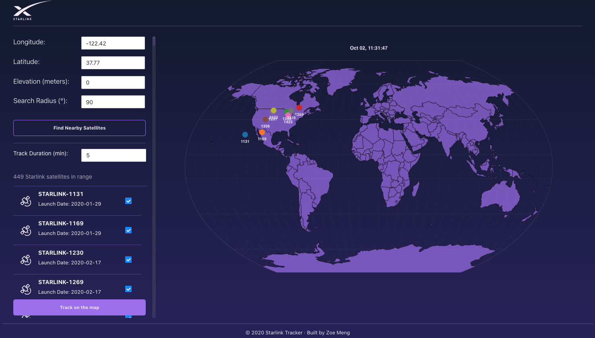

# Starlink Tracker

Find the Starlink satellites above any point on Earth, pick a few, and watch where they go next on a world map.



## What it does

1. Enter a location (longitude, latitude, elevation) and a search radius.
2. The app lists every Starlink satellite currently in range, using the N2YO "above" API (category 52).
3. Select one or more satellites and press **Track on the map**. The app fetches their next 5 minutes of positions and plays them back on the map at 50× speed, each satellite in its own color, with a clock showing the time being played back.

## How it's built

- **React 17 + Ant Design** for the UI.
- **D3 + TopoJSON** for the map. Countries come from `world-atlas` (110m) and are drawn with `d3-geo` on the Kavrayskiy VII projection from `d3-geo-projection`, which keeps both shapes and areas readable on a world view.
- **Two stacked canvases.** The base map (177 countries plus a graticule) is drawn once. Satellites go on a transparent canvas above it, and only that layer is cleared and redrawn each frame, so playback never redraws the countries.
- **One shared projection** (`src/projection.js`) for both layers, so every satellite lands on the right spot on the map. Both canvases scale together with CSS, so they stay aligned at any screen width.
- **API key stays on the server.** The browser only calls `/n2yo/...`. A small proxy adds the N2YO key before forwarding the request: `src/setupProxy.js` in development and a Cloudflare Pages Function (`functions/n2yo/[[path]].js`) in production. The production proxy only forwards the two endpoints the app uses and only accepts numeric parameters, so it can't be used as an open proxy.

## Run locally

Requires Node 18 or newer and a free N2YO API key from [n2yo.com/api](https://www.n2yo.com/api/).

```bash
git clone https://github.com/zoeMeng1225/spaceX.git
cd spaceX
npm install
cp .env.example .env.local   # then paste your key into .env.local
npm start
```

Then open http://localhost:3000.

## Deploy to Cloudflare Pages

1. Connect the repo in Cloudflare Pages.
2. Build command: `npm run build`. Output directory: `build`.
3. Under **Settings → Environment variables**, add `N2YO_API_KEY`.

The `functions/` folder is picked up automatically and serves `/n2yo/*`.

## Limits

N2YO returns at most 300 seconds of positions per request, which is why tracking is capped at 5 minutes. The free tier also allows 100 "above" and 1,000 "positions" requests per hour.

## History

Originally built in 2020. Updated in 2026:

- Moved the API key out of the source code and behind a server-side proxy.
- Fixed satellites being drawn at a different map scale than the countries (they now share one projection).
- Fixed the playback clock, per-satellite colors, the loading spinner, and the satellite checkboxes staying checked after a new search.
- Capped track duration at N2YO's 300-second limit.
- Bundled the world map data instead of fetching it from a CDN at runtime, and compressed the background image from 3.1 MB to 185 KB.
- Upgraded to Create React App 5 so it builds on current Node versions.

---

A personal project. Not affiliated with SpaceX or Starlink. Satellite data from [N2YO.com](https://www.n2yo.com/).
